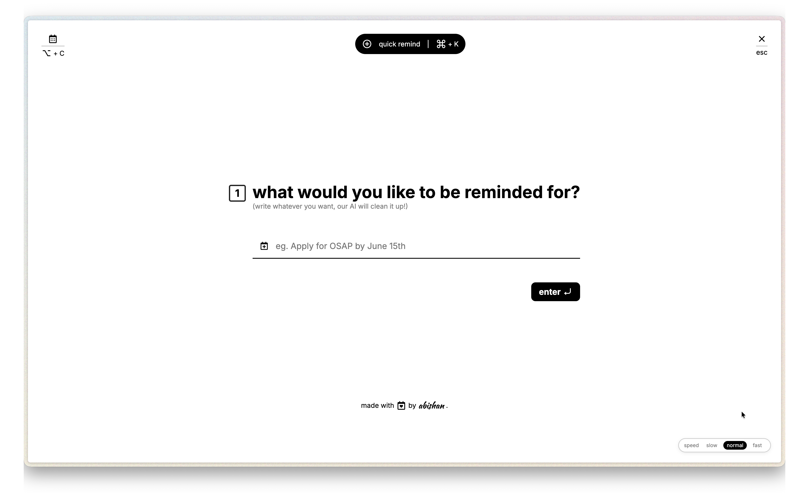

# Aisé

**creating reminders shouldn't be the hard part.**




## What is Aisé?

[](https://www.youtube.com/watch?v=iBecI4ypzVg)

Inspired by the ease of use of TypeForms, and from a hatred of the disgusting Apple Calendar Event forms (sorry Apple, y'all been falling off), Aisé aims to be a useful way for users to quickly create reminders, so they can get to work, rather than waste time crafting the perfect reminder.

It utilizes the Django REST framework and a frontend designed by the ground-up (by a human), in Vanilla HTML and CSS, for creating, listing, and parsing reminders. It includes optional local LLM integration (via Ollama) to parse natural-language reminder text into structured reminder data (title, date, time, location).

## Features

- **Reminders CRUD:** REST endpoints to create, read, update and delete reminders using Django REST Framework.
- **AI parsing:** `/api/ai/parse/` endpoint uses a local Ollama model to extract structured fields from free-text reminders. Falls back to Python heuristics when Ollama is not available.
- **Title polishing:** `/api/ai/polish/` endpoint to clean up reminder titles (uses Ollama when available, otherwise local heuristics).
- **Simple frontend:** Single-page app served at the root to demo the UI (`templates/Aisé/app.html`).
- **User-aware storage:** Reminders may be associated with authenticated users; anonymous/demo usage supported.

## Tech stack

- Python 3.11+
- Django + Django REST Framework
- SQLite (default development DB)
- Optional: Ollama + Qwen 3.5 (for AI parsing)

## Project layout

- `manage.py` — Django management entrypoint
- `config/` — Django project settings and URL config
- `Aisé/` — main app: models, serializers, views, templates, static files
- `db.sqlite3` — default SQLite database (development)

## API endpoints

- `GET /api/reminders/` — list reminders (DRF)
- `POST /api/reminders/` — create reminder
- `POST /api/ai/parse/` — parse free-text reminder into JSON
- `POST /api/ai/polish/` — polish a reminder title

These are registered in `config/urls.py` and implemented in `Aisé/views.py`.

## Running locally (development)

1. Create a virtual environment and install dependencies:

```bash
python -m venv .venv
source .venv/bin/activate
pip install -r requirements.txt
```

2. Apply migrations and run the dev server:

```bash
python manage.py migrate
python manage.py runserver
```

3. Open the frontend in your browser:

```
http://127.0.0.1:8000/
```

4. (Optional) Use Ollama for better parsing:

- Install Ollama and pull an appropriate model (e.g. `qwen3.5`).
- Ensure the `ollama` Python package is installed in your environment.

If Ollama is not installed or the model is unavailable, the AI endpoints fall back to built-in Python parsing heuristics.

## Configuration & secrets

This repo currently uses a minimal local setup. If you add external services, keep credentials out of source control and load them via environment variables or a `.env`/`secrets.env` file.

## Limitations

- Intended as a lightweight demo / starter app — not hardened for production use.
- No production authentication, rate-limiting, or strict validation beyond basic serializers.
- Ollama integration is optional and requires a compatible local environment.

## Next steps and ideas

- Add user registration / authentication flows (JWT or social login).
- Add tests for AI fallbacks and serializers.
- Deploy with Docker and add a production-grade DB and static file serving.
- Add a small CI check that runs linters and basic tests.

>[!NOTE]
> - UI was completely me (Vanilla HTML and CSS)
> - Django REST framework was also me
> - Claude was used solely for the javascript, which will be done by me (it's trash) once I get home
> - yes a lot of this README was generated as well 😭


